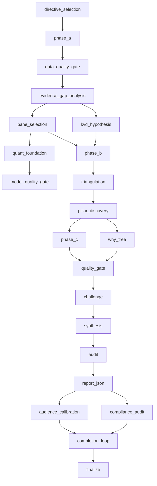

# XVARY Methodology (Public Framework)

This document is the **public framework** for XVARY Research.

It is intentionally the **menu, not the recipe**: stage names, logic flow, and decision philosophy are published; internal prompts, thresholds, and convergence algorithms are not.

Full narrative: [xvary.com/methodology](https://xvary.com/methodology)

## Research Philosophy

XVARY is built around five principles:

1. **Variant perception first**: value comes from being directionally right where consensus is wrong.
2. **Evidence before narrative**: facts constrain the story, not the other way around.
3. **Conviction is earned**: scores reflect cross-validated support, not tone or confidence theater.
4. **Adversarial challenge is mandatory**: every thesis gets attacked before publication.
5. **Kill-file discipline**: each call includes explicit thesis-invalidating conditions.

## 22-Stage Operational DAG (21-Stage Research Spine + Finalize)

> The operational DAG has 22 nodes in code (`finalize` included). Publicly we refer to the core research spine as the 21-stage methodology and treat finalization as release control.

### Stage Intent (One-Line)

1. `directive_selection`: choose sector/style evidence directives.
2. `phase_a`: collect baseline facts, filings, market context, and broad evidence.
3. `data_quality_gate`: block low-integrity factual inputs.
4. `evidence_gap_analysis`: detect missing evidence and open targeted searches.
5. `kvd_hypothesis`: identify candidate key value drivers.
6. `pane_selection`: choose report panes for company profile.
7. `quant_foundation`: build model scaffolding (valuation/risk context).
8. `model_quality_gate`: sanity-check model outputs before synthesis.
9. `phase_b`: run enrichment search and deeper context collection.
10. `triangulation`: compare evidence across independent reasoning vectors.
11. `pillar_discovery`: derive weighted thesis pillars.
12. `phase_c`: execute module-level synthesis in parallel.
13. `why_tree`: decompose causal claims and dependency chains.
14. `quality_gate`: run structured quality tests and consistency checks.
15. `challenge`: adversarially test each pillar and assumptions.
16. `synthesis`: assemble conviction, variant view, and scenario posture.
17. `audit`: multi-role verification with follow-up rounds.
18. `report_json`: build structured report payload.
19. `audience_calibration`: ensure readability + decision-usefulness.
20. `compliance_audit`: verify methodology and policy compliance.
21. `completion_loop`: repair sparse or inconsistent sections.
22. `finalize`: release gating and artifact finalization.

## Quality Gates (Public Names + What They Check)

- **Data Quality Gate**: missingness, stale fields, broken units, filing coherence.
- **Model Quality Gate**: sanity bounds, impossible outputs, assumption integrity.
- **Quality Gate**: cross-module consistency, contradiction flags, evidence sufficiency.
- **Audience Calibration**: clarity, thesis readability, decision speed under time pressure.
- **Compliance Audit**: methodology adherence, sourcing hygiene, output policy checks.
- **Finalize Gate**: final validation + publication readiness.

## 23 Research Modules

1. `kvd`: key value-driver identification and trajectory framing.
2. `core_facts`: baseline thesis framing and variant setup.
3. `operations`: revenue engine, segment economics, moat mechanics.
4. `financials`: profitability, balance-sheet quality, cash conversion.
5. `valuation`: intrinsic range, scenario math, and expectation gap.
6. `management`: leadership quality, incentives, and execution credibility.
7. `competition`: market structure, rival dynamics, strategic pressure.
8. `risk`: kill criteria, thesis breakers, and downside maps.
9. `capital_allocation`: buybacks/dividends/M&A capital discipline.
10. `governance`: board structure, oversight quality, shareholder alignment.
11. `catalysts`: event map and timing-sensitive thesis triggers.
12. `product_tech`: product moat, roadmap durability, and innovation path.
13. `supply_chain`: supplier dependency, resilience, and bottleneck exposure.
14. `tam`: market size realism, penetration runway, and saturation risk.
15. `street`: consensus expectations vs. internal thesis.
16. `macro_sensitivity`: rates/FX/cycle sensitivity mapping.
17. `value_framework`: investment framework fit + decision rubric.
18. `quant_profile`: factor, drawdown, and liquidity behavior profile.
19. `signals`: alternative/leading indicators and signal dashboard.
20. `derivs`: options/short-interest positioning context.
21. `earnings_track`: beat/miss quality and guidance reliability.
22. `history`: strategic timeline and historical analog framing.
23. `executive_summary`: cross-module synthesis for fast decisioning.

## Conviction Scoring (Concept)

Conviction is built from weighted pillars rather than a single-model output:

- Pillar strength (how well each core claim is supported)
- Pillar dependency risk (how fragile each claim is)
- Cross-module consistency (do independent modules agree?)
- Adversarial challenge survival (did core claims hold up?)
- Downside asymmetry under identified kill criteria

Weights are dynamic by business model and evidence reliability. Exact calibration is proprietary.

## Kill-File Risks (Concept)

Every thesis is paired with explicit conditions that invalidate it. A kill file is not a downside list; it is the shortest set of assumptions that, if broken, forces re-underwriting.

Typical kill-file categories:

- Structural demand break
- Unit-economics deterioration
- Balance-sheet fragility
- Regulatory/regime shock
- Management credibility failure

## Five-Vector Triangulation (Concept)

Each ticker is evaluated through five independent vectors before synthesis:

1. **Accounting reality**
2. **Market-implied expectations**
3. **Operational execution**
4. **Strategic position / industry structure**
5. **Macro-regime sensitivity**

The goal is convergence testing: where vectors agree, conviction rises; where they diverge, uncertainty is made explicit.

## Intentionally Not Published

- Module prompt templates
- Prompt routing logic and fallback trees
- Threshold matrices and gating cutoffs
- Internal convergence scoring mechanics
- Sector-specific directive libraries
